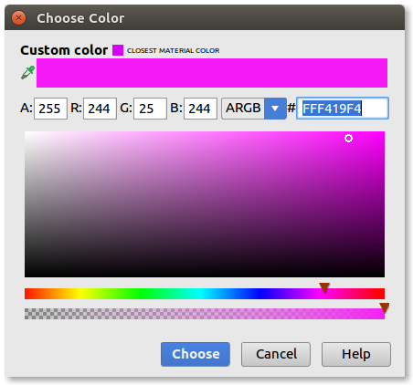

# Extra features of the REV Expansion Hub

You may have been perusing the [Rev Robotics Expansion Hub Guide](http://www.revrobotics.com/content/docs/REV-31-1153-GS.pdf) and have been dissapointed to see this:


**Fear not! OpenFTC to the rescue!** :D

OpenFTC provides support for **all** of the embedded sensor inside of the REV Robotics Expansion Hub, including:

 - Total module current sensor
 - Per-motor current sensors
 - Servo bus current sensor
 - GPIO current sensor
 - I2C current sensor
 - Internal temperature sensor
 - 12v monitor sensor
 - 5v monitor sensor
 - Controlling the RGB LED

## About the RevSensorReading object

**All of the methods detailed on this page return a `RevSensorReading` object.**

A `RevSensorReading` object provides two internal variables that can be accessed like so:

```java
reading.formattedValue
reading.doubleValue
```

### formattedValue

`formattedValue` is a `String` which will return the value in either:

 - Milliamps
 - Millivolts
 - Amps
 - Volts

What is returned depends on what type of reading it is (volts or current) and whether the milli unit has a value of greater than 1,000

**This is what you'll want to use for sending to telemetry**

For example, if your flywheel motor is spinning slowly and consuming 600 milliamps of current, `formattedValue` will be `"600ma"`. If however, you command full speed and your flywheel is consuming 1500 milliamps of current, `formattedValue` will return `"1.5a"`.

### doubleValue

`doubleValue` is just what is sounds like: a `double` containing the raw reading from the sensor. It will always be the milli unit (milliamps or millivolts)

**This is what you'll want to use for boolean expressions**


## Per-motor-port current sensors

Accessing these sensors is quite straightforward. All you need to do is cast your motor object to an `OpenDcMotor` and call `getCurrentDraw()`

For example:

```java
//In your init code
OpenDcMotor winchMotor = (OpenDcMotor) hardwaremap.dcmotor.get("winch"):

//In your main loop
telemetry.addData("Winch motor current", winchMotor.getCurrentDraw().formattedValue);
telemetry.update();
```

## Obtaining a pointer to a REV Hub object

All of the following sensor calls (that is, everything except the per-motor current sesnors) require a pointer to an OpenRevHub object.

Obtaining this is quite simple:

```java
//In your init code
OpenRevHub revHub = hardwareMap.get(OpenRevHub.class, "Expansion Hub 1");
```

(Where "Expansion Hub 1" is the name of the Hub in your config file)

## Total module current sensor

This sensor mearsures the total amount of current going through the Hub's XT30 connector.

It can be used like so:

```java
//See the 'Obtaining a pointer to a REV Hub object' section above
telemetry.addData("Total current", revHub.getTotalModuleCurrentDraw().formattedValue);
telemetry.update();
```

## Servo bus current sensor

This sensor measures the total, combined amount of current going through all of the servo ports on the Hub.

It can be used like so:

```java
//See the 'Obtaining a pointer to a REV Hub object' section above
telemetry.addData("Servo bus current", revHub.getServoBusCurrentDraw().formattedValue);
telemetry.update();
```

## GPIO bus current sensor

This sensor measures the total, combined amount of current going through all of the analog and digital I/O ports on the Hub. (**Note:** this does *not* include the I2C bus)

It can be used like so:

```java
//See the 'Obtaining a pointer to a REV Hub object' section above
telemetry.addData("GPIO bus current", revHub.getGpioBusCurrentDraw().formattedValue);
telemetry.update();
```

## I2C bus current sensor

This sensor measured the total, combined amount of current going through all of the I2C ports on the Hub.

It can be used like so:

```java
//See the 'Obtaining a pointer to a REV Hub object' section above
telemetry.addData("I2C bus current", revHub.getI2CbusCurrentDraw().formattedValue);
telemetry.update();
```

## Temperature sensor

This sensor measures the internal temperature of the Expansion Hub. The units are currently unknown.

It can be used like so:

```java
//See the 'Obtaining a pointer to a REV Hub object' section above
telemetry.addData("Temp", revHub.getInternalTemperature().formattedValue);
telemetry.update();
```

## 12v monitor

This sensor measures the voltage coming into the Hub's 12v XT30 input port.

It can be used like so:

```java
//See the 'Obtaining a pointer to a REV Hub object' section above
telemetry.addData("12v monitor", revHub.read12vMonitor().formattedValue);
telemetry.update();
```

## 5v monitor

This sensor measures the voltage coming out of the Expansion Hub's internal 5v regulator (which powers the servo bus and aux 5v ports)

It can be used like so:

```java
//See the 'Obtaining a pointer to a REV Hub object' section above
telemetry.addData("5v monitor", revHub.read5vMonitor().formattedValue);
telemetry.update();
```

## Changing the Hub's LED color

OpenFTC also provides support for changing the color of the Hub's built-in RGB LED.

The first thing you will want to do is create a `colors.xml` file as shown below:


Inside of that file, you can create color entries like so:

```xml
<?xml version="1.0" encoding="utf-8"?>
<resources>
    <color name="pink">#f419f4</color>
</resources>
```

If you copy and paste the above code into your XML file, you should see a little pink square pop up to the left of the `<color>` line. If you click on that, Android Studio will open a color picker where you can choose a custom color:



You will need to define any colors you want to set the Hub's LED to in this XML file. Once you have defined some colors, you can actually send the color change command like so:

```java
//Note: the "pink" in the below line corrasponds to the `name` attribute you declared for the color in the XML entry
revHub.setLedColor(hardwareMap, R.color.pink);
```

### Legality of changing the LED color in a match


