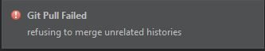

# Updating to a new version of OpenRC (aka OpenFTC-app)

If you aren't already a user of OpenRC, you're in the wrong place. See our guide for switching here.

These instructions consistently use the term "OpenRC". These instructions are identical regardless
of whether or not you are updating from OpenFTC-app. This document uses the term "OpenFTC" by itself
to indicate the organization that maintains and hosts the OpenRC apps.

## Before you begin
1.  Make sure you are using at least Android Studio 3.0. This is required for
    all OpenRC 2.x versions.

## For Git Users

If you're using Git, try following these instructions. How you have your repository set up will
determine whether or not they will work. If they don't work, either follow the non-Git instructions
or join the #support channel on [our Discord server](http://discord.gg/2dcxvdF) and ask for
individualized assistance.

These instructions may look lengthy, but most of what is written is really just about helping you set
up your remotes properly, which only needs to be done once. Once you know what you're doing, it's actually
much quicker than the non-Git method.

1.  Commit your current changes.

2.  Choose `VCS > Git > Pull` from the Android Studio menu, and click the refresh button (circling
    arrows) next to the Remote dropdown.

3.  From the Remote dropdown, select the appropriate OpenRC or OpenFTC-app repository. Make sure that
    the URL includes `https://github.com/OpenFTC` in all cases, and `-turbo` if you are using Turbo.
    It's OK if your remote still references the old OpenFTC-app or OpenFTC-app-turbo repositories, because
    GitHub automatically redirects the request.

4.  If you see more than one remote that points to some variant of OpenRC (not counting your own
    repository), delete all but one of them using the `VCS > Git > Remotes` menu option.

5.  If you still have a remote in the list that points to the official FIRST repository, I recommend
    deleting it, especially if it's named `upstream` (which by convention, should point to the OpenRC or
    OpenRC-turbo repository). You can delete it from the `VCS > Git > Remotes` menu option. The reason I
    recommend this is that you don't want to pull from it when you're using OpenRC. If FIRST has released
    an update that we haven't updated to yet, you could mess things up.

6.  Now that we've got your remotes straightened out, let's continue. Check the box next to the
    `<remote-name>/master` branch and make sure that all others are unchecked. Unless you know what you're
    doing and are testing something for the OpenFTC team, never pull from any of the other branches. It
    may severely clutter your Git history. It's fine to pull branches you made in your own repository, of
    course.

7.  Leave the strategy at `<default>`, leave the bottom four boxes unchecked, and click the `Pull` button.

8.  If a window comes up with merge conflicts, use your best judgement to resolve them line-by-line. Merge
    conflicts are much more likely if you've modified code in one of the non-TeamCode modules, or if you've
    added additional modules (e.g. OpenCV).  In most cases, you don't want to accept an entire version of a
    particular file. If you need help with this part, come ask in Discord.

9.  If you had any merge conflicts, you'll need to commit the merge after resolving them. Otherwise, you
    can continue to the [post-update procedures](#post-update-procedures).

## For non-Git users

1.  Download the zip file of the current master branch of your chosen OpenRC variant.  
    [Direct link for Standard](https://github.com/OpenFTC/OpenRC/archive/master.zip)  
    [Direct link for Turbo](https://github.com/OpenFTC/OpenRC-turbo/archive/master.zip)

2.  Extract the zip file wherever you'd like your code to live (if you want to extract it to the same location
    and same name as the old version, rename your old folder first).

3.  Replace the `TeamCode\src` folder in this new folder with the `TeamCode\src` folder from your old folder.
    **Do not** replace the entire `TeamCode` folder.

## Post-update Procedures

1.  If you're updating from a pre-2.0 version (named OpenFTC-app), you'll need to approve removing the OpenFTC
    module. You can also delete the OpenFTC folder (which should just contain a build folder by this point).

2.  Do a Gradle sync (`Tools > Android > Sync Project with Gradle Files` on Android Studio 3.0).

3.  After the Gradle sync has finished, you may have to reselect `TeamCode` from the dropdown menu between
    the Run and Build buttons.

## Troubleshooting

### I got this error message saying "refusing to merge unrelated histories"

Make sure that the remote you're pulling from is correct. Be careful about whether or not you're pulling from
Turbo, and make sure that the repository URL includes `github.com/OpenFTC`. 

If that doesn't work, you probably don't have your repository set up as a fork of either OpenRC or the official
FTC app. The command `git pull <remote> master --allow-unrelated-histories` may do the trick, but you're likely
to have significantly more merge conflicts than you would otherwise. If you can't get that to work, try the
instructions for non-Git users. You'll need to adapt them a little bit in order to end up with your old Git history
and the new version of OpenRC. In any case, [join us on Discord](http://discord.gg/2dcxvdF) if you need help.

### The OpenRC module displays as `OpenRC [OpenRC-OpenRC]`
If you see something like this, it's probably because you renamed your project to OpenRC after updating. This is
harmless, but if you want to get rid of it, you can try deleting all of the `*.iml` files in the project and
reimporting it. Or just name your project folder something else.
